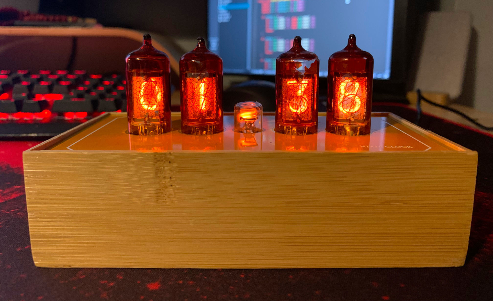

# Nixie Clock

## About

This repository contains software for nixie clock build on tubes `Z573M`, real-time clock `DS3231SO`, and `ATMEGA328P` microcontroller.

## Authors

- **Dawid Placha** - Hardware and design
- **Dariusz Iwanoczko** - Software implementation

## License

[MIT License](LICENSE)
